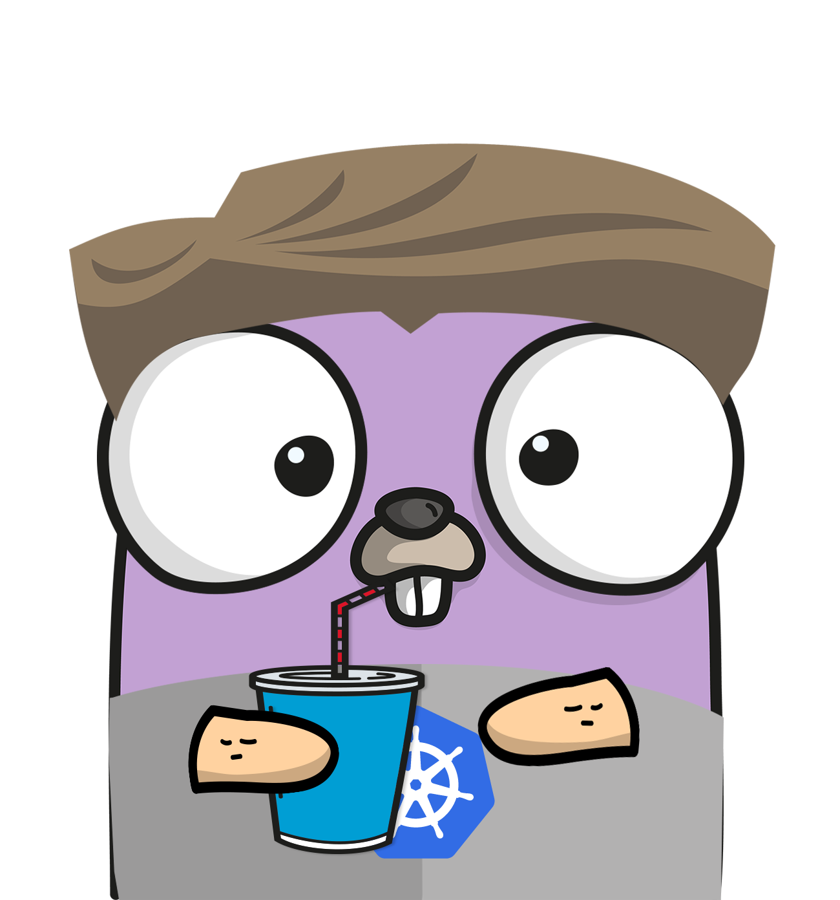

[](https://github.com/jose78/kubectl-alias/actions/workflows/release.yml)

[](https://goreportcard.com/report/github.com/jose78/kubectl-alias)


# kubectl-alias 


## Description

kubectl-alias is a kubectl plugin that allows customizing command output using SQL, enabling JOIN operations between different types of Kubernetes objects. This plugin helps users perform advanced queries to obtain detailed and structured information about their cluster.

## Installation

There are several ways to install the software:

* **Download directly from the Release:**
  To install kubectl-alias, simply download it and add it to your `$PATH`. Ensure the binary has execution permissions:

```shell
chmod +x kubectl-alias
mv kubectl-alias /usr/local/bin/
```

* Clone the repo and build your own executable:
```shell 
git clone https://github.com/jose78/kubectl-alias.git
cd kubectl-alias
go mod tidy
go build -o kubectl-alias
mv kubectl-alias /usr/local/bin/
```

## Configuration

Configuration
The plugin requires the KUBEALIAS environment variable to point to a configuration file with the following YAML structure:

```yaml
---
version: v1 # The current version of the API.
aliases:
  PUT_HERE_YOUR_SUBCOMMAND:
    short: Short description of your functionality (mandatory)
    long: Long description of your functionality with examples (mandatory)
    args: List of strings, with the name of the param to be replaced within the select (optional)
    sql: Select statement to be executed (mandatory)

  PUT_HERE_YOUR_ANOTHER_SUBCOMMAND:
    short: Short description of your functionality (mandatory)
    long: Long description of your functionality with examples (mandatory)
    sql: Select statement to be executed (mandatory)
    
```

Save this file in an accessible location and set the environment variable:

```shell
export KUBEALIAS=/path/to/file.yml

```

## Usage

Once installed and configured, you can run the plugin like any other kubectl command:

```shell

kubectl alias PUT_HERE_YOUR_SUBCOMMANDS

```

## Example

In my case, I have now only one alias called simple_pod.

```yaml
---
version: v1
aliases:
  simple_pod:
    short: Show the description of each pod and linked service.
    args:
         - POD_NAME
    long: |
        This complex query joins multiple Kubernetes resources to provide a detailed view of the pod ecosystem. It returns:
            * The pod's namespace
            * The name of the node where the pod is running
            * The name of the pod 
            * Service info
    sql: |
          SELECT  p.metadata.namespace as NAMESPACE , n.metadata.name as NODE_NAME , p.metadata.name POD_NAME, 'service ' || s.metadata.name || ':'  ||  s.spec.ports[0].port || ' -> ' || s.spec.ports[0].targetPort as SVC
          FROM 
              pod p, svc s, deploy d , node n
          where p.metadata.labels.app = s.spec.selector.app 
          and d.metadata.labels.app = s.spec.selector.app  
          and  p.metadata.name like '%POD_NAME%'
```
Please note that within the example, we have only one argument and it is referenced inside the select statement.

Executing the next command:
```yaml
kubectl alias simple_pod test
```

I get the following result:


## Road Map
  * Add other output formats (json, yaml, csv) or custom using a Go template.
  * Add OpenShift functionality.
  * Allow using more formats to configure the KUBEALIAS like TOML, json, etc.
  * Enable using functions of Go Template.
  * Manager to add online subcommands.

## Contributing
Contributions are welcome. To report issues or suggest improvements, open an issue in the project repository.

## License
This project is licensed under the MIT License. See the LICENSE file for more details.
